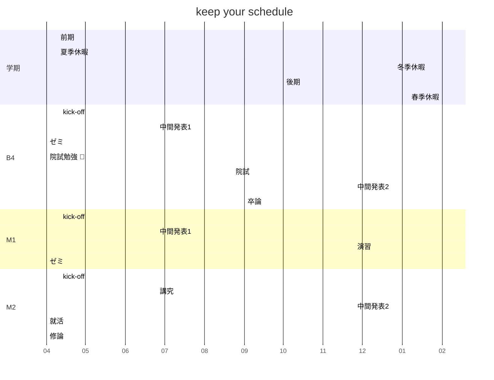

Project Name
====
Some short description here.
Some awesome images here.

TOC, lof, lot
----
|||
|:-:|:-----------------:|
|TOC|Table Of Contents|
|lof|list of tables|
|lot|list of figures|

Introduction
----
### preamble
You know what?

### statment of the problem
Here's something......

### VS / related study
Previous study shows something:)

### TL;DR
We did something!

Preliminary
----
When you need to explain something.

Body Chapters(Plural)
----
Each of the chapters contains bellow.

### Data and Methods
What you use.

### Results
What you get.

### Discussion
What you say.

Conclusion
----
Summarize your opinion.

Acknowledgment
----
This is the only place of you.

Reference
----
DO EXACTLY AS YOUR SUPERVISOR TELL/TOLD YOU!

Appendix
----
If you have something that help reading.

Index
----
When you have done everything and still have some time left.
