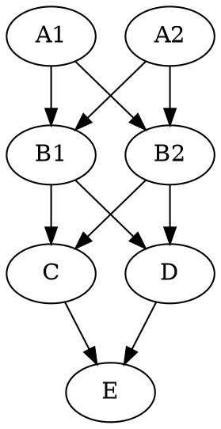

### [GraphViz](https://shd101wyy.github.io/markdown-preview-enhanced/#/diagrams?id=graphviz)

```dot {engine="dot"}
digraph G {
    A1 -> B1
    A2 -> B1
    A1 -> B2
    A2 -> B2
    B1 -> C
    B1 -> D
    B2 -> C
    B2 -> D
    C -> E
    D -> E
}
```

```dot {engine="circo"}
digraph G {
    A1 -> B1
    A2 -> B1
    A1 -> B2
    A2 -> B2
    B1 -> C
    B1 -> D
    B2 -> C
    B2 -> D
    C -> E
    D -> E
}
```

```dot {engine="neato"}
digraph G {
    A1 -> B1
    A2 -> B1
    A1 -> B2
    A2 -> B2
    B1 -> C
    B1 -> D
    B2 -> C
    B2 -> D
    C -> E
    D -> E
}
```

```dot {engine="osage"}
digraph G {
    A1 -> B1
    A2 -> B1
    A1 -> B2
    A2 -> B2
    B1 -> C
    B1 -> D
    B2 -> C
    B2 -> D
    C -> E
    D -> E
}
```

```dot {engine="twopi"}
digraph G {
    A1 -> B1
    A2 -> B1
    A1 -> B2
    A2 -> B2
    B1 -> C
    B1 -> D
    B2 -> C
    B2 -> D
    C -> E
    D -> E
}
```
